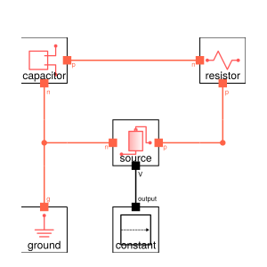
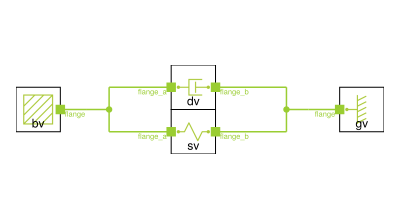

# ModelingToolkitDesigner.jl

The ModelingToolkitDesigner.jl package is a helper tool for visualizing and editing ModelingToolkit.jl system connections.  

## Examples
Examples can be found in the "examples" folder.

### Hydraulic Example


### Electrical Example



### Mechanical Example



# Tutorial

Let's start with a simple hydraulic system with no connections defined yet...

```julia
using ModelingToolkit
using ModelingToolkitDesigner
using GLMakie

import ModelingToolkitStandardLibrary.Hydraulic.IsothermalCompressible as IC
import ModelingToolkitStandardLibrary.Blocks as B


@parameters t

@component function system(; name)

    pars = []

    systems = @named begin
        stp = B.Step(;height = 10e5, start_time = 0.005)
        src = IC.InputSource(;p_int=0)
        vol = IC.FixedVolume(;p_int=0, vol=10.0)
        res = IC.Pipe(5; p_int=0, area=0.01, length=500.0)
    end
   
    eqs = Equation[]
    
    ODESystem(eqs, t, [], pars; name, systems)
end

@named sys = system()
```

Then we can visualize the system using `ODESystemDesign()` and the `view()` functions

```julia
path = joinpath(@__DIR__, "design") # folder where visualization info is saved and retrieved
design = ODESystemDesign(sys, path);
ModelingToolkitDesigner.view(design)
```


Components can then be positioned in several ways:
- keyboard: select component and then use up, down, left, right keys
- mouse: click and drag (currently only 1 component at a time is supported)
- alignment: select and align horrizontal or vertial with respective buttons


Nodes/Connectors can be positioned by selecting with the mouse and using the __move node__ button.  *Note: Components and Nodes can be de-selected by right clicking anywhere or using the button* __clear selection__


Connections can then be made by clicking 2 nodes and using the __connect__ button.  One can then click the __save__ button which will store the visualization information in the `path` location in a `.toml` format as well as the connection code in `.jl` format.


The connection code can also be obtained with the `connection_code()` function

```julia
julia> connection_code(design)
connect(stp.output, src.input)
connect(src.port, res.port_a)
connect(vol.port, res.port_b)
```

After the original `system()` component function is updated with the connection equations, the connections will be re-drawn automatically when using `ModelingToolkitDesigner.view()`.  *Note: CairoMakie vector based images can also be generated by passing `false` to the 2nd argument of `view()` (i.e. the `interactive` variable).*

# Hierarchy
If a component has a double lined box then it is possible to "look under the hood".  Simply select the component and click __open__.


Edits made to sub-components can be saved and loaded directly or indirectly.  

# Pass Thrus
To generate more esthetic diagrams, one can use as special kind of component called a `PassThru`, which simply defines 2 or more connected `connectors` to serve as a corner, tee, or any other junction.  Simply define a component function starting with `PassThru` and ModelingToolkitDesigner.jl will recognize it as a special component type.  For example for a corner with 2 connection points:


```julia
@component function PassThru2(;name)
    @variables t
    
    systems = @named begin
        p1 = Pin()
        p2 = Pin()
    end

    eqs = [
        connect(p1, p2)
    ]

    return ODESystem(eqs, t, [], []; name, systems)
end
```

And for a tee with 3 connection points

```julia
@component function PassThru3(;name)
    @variables t
    
    systems = @named begin
        p1 = Pin()
        p2 = Pin()
        p3 = Pin()
    end

    eqs = [
        connect(p1, p2, p3)
    ]

    return ODESystem(eqs, t, [], []; name, systems)
end
```

Adding these components to your system will then allow for corners, tees, etc. to be created.  When editing is complete, use the toggle switch to hide the `PassThru` details, showing a more esthetic connection diagram.


 

# Icons
ModelingToolkitDesigner.jl comes with icons for the ModelingToolkitStandardLibrary.jl pre-loaded.  For custom components, icons are loaded from the `path` variable supplied to `ODESystemDesign()`.  To find the path ModelingToolkitDesign.jl is searching, pass the system of interest to `ODESystemDesign()` and replace the `.toml` with `.png`.  For example if we want to make an icon for the `sys.vol` component, we can find the path by running...

```julia
julia> ODESystemDesign(sys.vol, path).file
"./design\\ModelingToolkitStandardLibrary\\Hydraulic\\IsothermalCompressible\\FixedVolume.toml"
```

Placing a "FixedVolume.png" file in this location will load that icon.

# Colors
ModelingToolkitDesigner.jl colors the connections based on `ModelingToolkitDesigner.design_colors`.  Colors for the ModelingToolkitStandardLibrary.jl are already loaded.  To add a custom connector color, simply use `add_color(system::ODESystem, color::Symbol)` where `system` is a reference to the connector (e.g. `sys.vol.port`) and `color` is a named color from [Colors.jl](https://juliagraphics.github.io/Colors.jl/stable/namedcolors/).

# TODO
- Finish adding icons for the ModelingToolkitStandardLibrary.jl
- Add documentation

# [compat]
- ModelingToolkit = "8.50" > needed for Domain feature
- ModelingToolkitStandardLibrary = "1.12" > needed for Hydraulic components